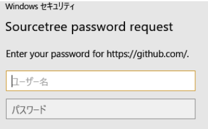

# github-actions-sample
GitHub ActionsでHello World

## SourceTreeでリモートへのプッシュがエラーになる場合
### 1. GitHub：スコープ設定とトークン取得

githubログイン ＞ 右上メニューの「Settings」＞ サイドバー「Developer settings」＞ サイドバー「Personal access token」＞ サイドバー「 tokens (classic)」を選択

「Generate new token」＞「Generate new  tokens (classic)」を選択

**※表示された「トークン」は控えておく**

下記を設定
- Note：SourceTree
- Expiration（有効期限）： no expiration
- Select scopes：「repo」、「workflow」、「 user」を選択

### 2. SourceTree（Windows10）：ユーザ認証

SourceTreeメニューの「ツール」＞「オプション」＞「認証」タブ ＞「追加」を選択

下記を設定
- ホスティングサービス：GitHub
- 有線するプロトコル：HTTPS
- 認証：Basic
- ユーザ名：GitHubのユーザ名

「パスワード再読み込み」押下し、下記画面が表示されたら下記を入力して認証する
- ユーザ名：GitHubのユーザ名
- パスワード：トークン

## 参考サイト
- [GitHub ActionsでHello World](https://qiita.com/Teach/items/d2c4d7bec98228df1807)
- [SourceTreeでGitHubのPersonal access tokensを利用する方法](https://zenn.dev/koushikagawa/articles/3c35e503c8553a)
